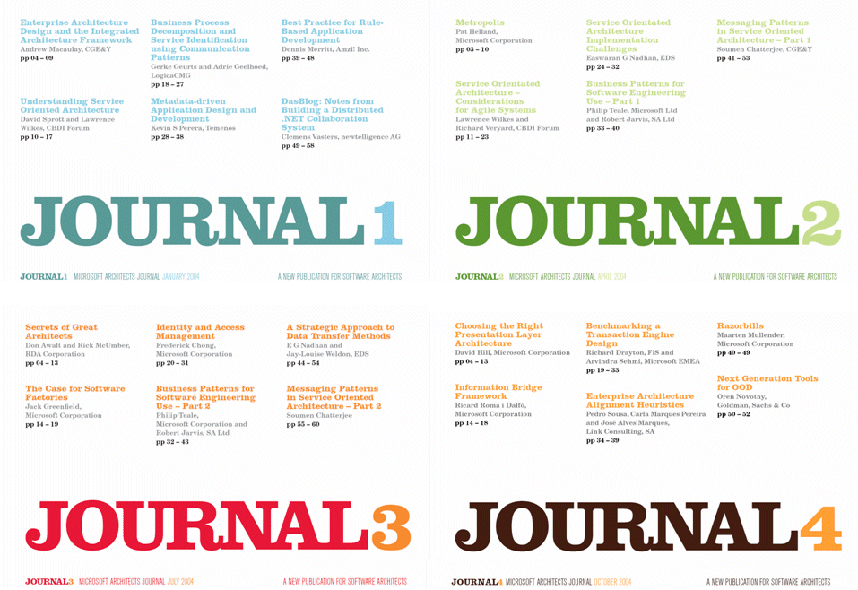
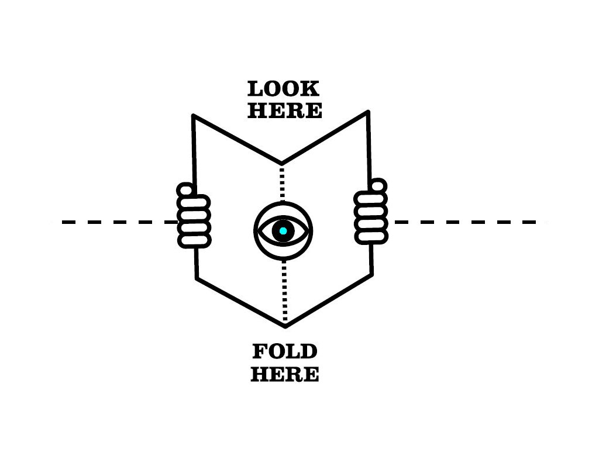

# JOURNAL - The Microsoft Architects Journal

When I created **JOURNAL** - _The Microsoft Architects Journal_ way back in 2003, we had no idea that it would have the success it achieved. At the end of its 7 year run it had a readership in excess of 100 thousand! Occasionally, I hear from ex-colleagues, friends and people in my professional network that its greatly missed and, above all, they ask "Where can I find back copies!?"

I found my archive of PDFs and decided to make them available to all for posterity. I wish those of you who come across this journal for the first time, could have read the hard copy -- it would have been so much more pleasureable than a PDF. A lot of attention and care was paid to the identity and articles quality of JOURNAL.

Software Architecture concepts are enduring, in my opinion. They have a habit of cropping up time and again, reinvented supposedly, and more often than not reused in the clothing of new technologies and platforms. The articles you will find in this archive still have value. For me it's a nostalgic experience, but I hope for you it'll be a really enjoyable learning experience.

Have fun!

Arvindra

---

## JOURNAL Objectives

* To provide thought leadership on a wide range of subjects on enterprise application architecture, design and development.
* To discuss the business and human-factor concerns that play a key role in enterprise systems development.
* To provide content of value not available through any other Microsoft offering.

## JOURNAL Identity

We felt the journal must have an independent identity because:

* It should stand out on its own
* It should not be seen as Microsoft mass-marketing communication
* It has to be an authoritative, trusted source of opinion
* It should appeal to a wide community of architects who’ll become authors in the future. They might be neutral on Microsoft and since we are not paying them to write articles and papers, credibility is key.
* It will be repeat publication not a one-off, winning its own audience – all successful publications like this have a unique identity of their own

Independence would help build this identity, and none of this would preclude benefitting from the power of the Microsoft brand. As the founding editor it was my job to convince my bosses at Microsoft that we could do this in a confident, low-key, _white-label_ way making JOURNAL more authentic and signalling that Microsoft is truly open to different partnerships, platforms and points of view. As they say, the rest is history thanks to the efforts of many Microsoft supporters and all those 100,000 delighted readers.

